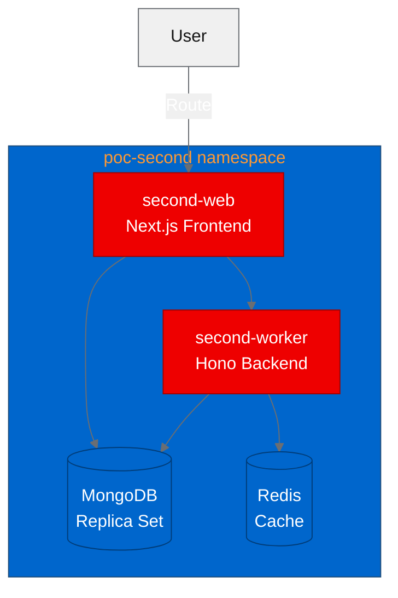

## What is Second?

[Second](https://github.com/Second-Inc/second) is an open source platform (Apache-2.0) for building custom internal software where AI agents and humans work side by side. Think of it as a framework for internal tools that lets you wire up AI-driven automation alongside manual workflows, so your team can move faster without giving up control.

Under the hood, Second is a multi-service application:

- A **Next.js web frontend** that serves the UI
- A **Hono-based worker backend** that handles async jobs and AI agent orchestration
- **MongoDB** for persistent storage
- **Redis** for caching and message brokering

That's four services with two custom containers and two databases. A solid test case for deploying a real-world application on OpenShift.

## Why it matters for OpenShift AI

AI-augmented internal tooling is a growing category. Teams want to embed LLM-powered agents into their operational workflows, but they also need the guardrails that come with a managed platform: RBAC, network policies, observability, and container security.

OpenShift provides exactly this. Deploying Second on OpenShift lets platform teams offer AI-powered internal tools with enterprise-grade infrastructure underneath. The PoC we ran validates whether a project like Second, built with a typical Node.js stack, can run on OpenShift without invasive changes.

## Containerizing for OpenShift

OpenShift runs containers as a non-root, arbitrary user ID by default. This is a security feature, but it breaks many community Docker images that assume root access or specific UIDs. The standard approach is to use Red Hat Universal Base Images (UBI), which are designed for this constraint.

We created two UBI-based Dockerfiles:

**Web frontend** (based on `ubi9/nodejs-22`): Installs dependencies with pnpm, builds the Next.js application, then copies the standalone output to a minimal runtime image based on `ubi9/nodejs-22-minimal`.

**Worker backend** (based on `ubi9/nodejs-22`): Similar multi-stage build, installs pnpm, builds the Hono worker, and runs on a minimal image.

Both Dockerfiles follow the same pattern:

1. Use a full UBI Node.js image as the build stage
2. Install pnpm globally via corepack
3. Copy and install dependencies
4. Build the application
5. Copy the build output to a `ubi9/nodejs-22-minimal` runtime image
6. Set permissions so the OpenShift arbitrary UID can read and execute

One issue we hit immediately: `chgrp` commands in UBI images can fail when the build context includes files owned by UIDs that don't exist in the container. We worked around this by being selective about which files we copied and adjusting permission commands to use `chmod` on specific directories rather than recursive `chgrp` on everything.

## Building and deploying

We initially planned to build images locally and push them to Quay.io. That plan hit a wall: Quay's rate limiting rejected our pushes during the PoC window. Instead, we switched to OpenShift's built-in binary build strategy, using `oc start-build --from-dir` to upload the build context directly to the cluster.

This turned out to be a better approach anyway. Binary builds run inside the cluster, so they benefit from the internal registry's bandwidth and avoid external rate limits entirely.

We deployed four services into the `poc-second` namespace:

MongoDB needed special attention. Second expects a replica set configuration, not a standalone instance. We deployed MongoDB as a StatefulSet with a replica set initialization script and set `directConnection=true` in the connection string. Without `directConnection=true`, the Node.js MongoDB driver tries to discover replica set members through DNS, which doesn't resolve correctly inside the OpenShift SDN when you're running a single-node replica set.

Redis deployed cleanly with a standard Deployment and Service.

## Running the PoC tests

We ran four validation tests against the deployed services:

| Test | Description | Result |
|------|-------------|--------|
| Health check | GET the web frontend route, expect HTTP 200 | Passed |
| API functional | Query the backend API endpoints | Passed |
| Worker responsive | Send a job to the worker and verify processing | Passed |
| Full integration | End-to-end workflow with AI agent interaction | Did not pass |

Three out of four tests passed. The health check confirmed the Next.js frontend was serving pages. The API functional test verified that the backend could handle requests. The worker responsiveness test confirmed that async job processing was operational.

The full integration test didn't pass because it required external AI provider credentials that weren't configured in the PoC environment. This is expected: the test validates that the platform's AI agent orchestration works, which depends on upstream LLM API access. The core infrastructure, meaning the web frontend, worker, database, and cache, all functioned correctly.

## What we learned

This PoC surfaced several practical lessons:

**Quay rate limiting is real.** If you're running automated builds that push to Quay.io, you'll hit rate limits quickly. OpenShift binary builds are a reliable alternative that avoids external registry dependencies during the build phase. For production, you'd push to an internal registry or a Quay instance with higher limits.

**MongoDB replica sets need directConnection=true.** This caught us off guard. A single-node MongoDB replica set inside OpenShift doesn't advertise its hostname correctly to external drivers. Setting `directConnection=true` in the connection URI bypasses the replica set discovery mechanism and connects to the pod directly. This is the correct approach for single-node replica sets in Kubernetes.

**UBI images have strict permission models.** The `chgrp` command fails when encountering files with unknown UIDs, which happens when you COPY files from build stages that ran as different users. The fix is to use `--chown` flags on COPY instructions or to `chmod` specific directories instead of recursively changing group ownership on the entire filesystem.

**Not all system packages are available.** Second's build process uses ripgrep (`rg`) for code searching during its AI agent workflows. Ripgrep isn't available in UBI repositories. We worked around this by ensuring the application gracefully degrades when `rg` isn't present, falling back to standard `grep`. For production, you'd either compile ripgrep from source or use a sidecar approach.

## Try it yourself

The forked repository with all OpenShift modifications is available at [github.com/aicatalyst-team/second](https://github.com/aicatalyst-team/second). You can reproduce this deployment on any OpenShift cluster:

1. Clone the fork and review the UBI Dockerfiles
2. Create a namespace: `oc new-project poc-second`
3. Set up binary builds for the web and worker images
4. Deploy MongoDB as a StatefulSet with replica set initialization
5. Deploy Redis with a standard Deployment
6. Create Deployments for the web and worker services, pointing to the internal image streams
7. Expose the web frontend with a Route

If you're evaluating whether your own multi-service Node.js application can run on OpenShift, the patterns we used here (UBI multi-stage builds, binary build strategy, directConnection for MongoDB) apply broadly. The fact that three of four tests passed with no changes to Second's application code shows that OpenShift compatibility is mostly a containerization and configuration exercise, not an application rewrite.
