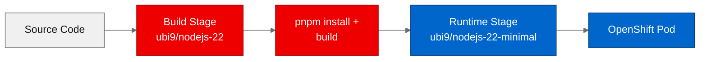
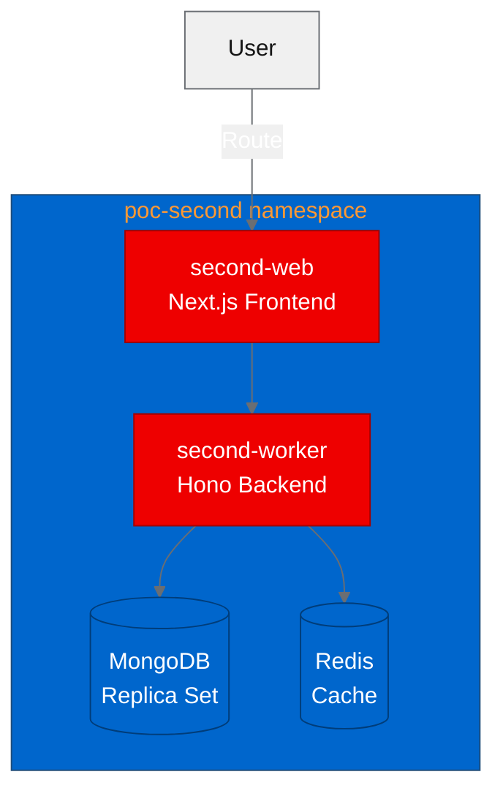

## Can a multi-service AI platform run on OpenShift without a rewrite?

That was the question we set out to answer. We took [Second](https://github.com/Second-Inc/second), an open source platform for building internal tools where AI agents and humans work side by side, and deployed it on OpenShift to find out. The result: 3 of 4 PoC tests passed, with no changes to Second's application code. The challenges we hit were all in containerization and configuration, not in the application itself.

Second isn't a toy project. It's a multi-service architecture with a Next.js web frontend, a Hono-based worker backend for async jobs and AI agent orchestration, MongoDB for persistent storage, and Redis for caching. Four services, two custom containers, two databases. If you're evaluating whether your own Node.js stack can run on OpenShift, the patterns we used here apply directly. You can follow along with [our fork](https://github.com/aicatalyst-team/second).

## Why it matters for OpenShift AI

AI-augmented internal tooling is a growing category. Teams want to embed LLM-powered agents into their operational workflows, but they also need guardrails: RBAC, network isolation, container scanning, and observability. OpenShift provides these out of the box, so teams don't have to build them from scratch.

Deploying Second on [Red Hat OpenShift](https://www.redhat.com/en/technologies/cloud-computing/openshift) validates a practical question. Can a typical Node.js multi-service app, one that wasn't designed for OpenShift, run on the platform without invasive changes?

## Containerizing for OpenShift

OpenShift runs containers as a non-root, arbitrary user ID by default. This is a security feature, but it breaks many community Docker images that assume root access or specific UIDs. The standard approach is to use [Red Hat Universal Base Images (UBI)](https://catalog.redhat.com/software/base-images), which are designed for this constraint.

We created two UBI-based Dockerfiles for the custom services. Here's the key pattern from the web frontend:

```dockerfile
FROM registry.access.redhat.com/ubi9/nodejs-22 AS build
RUN corepack enable && corepack prepare pnpm@latest --activate
COPY package.json pnpm-lock.yaml ./
RUN pnpm install --frozen-lockfile
COPY . .
RUN pnpm build

FROM registry.access.redhat.com/ubi9/nodejs-22-minimal AS runtime
COPY --from=build --chown=1001:0 /opt/app-root/src/.next/standalone ./
COPY --from=build --chown=1001:0 /opt/app-root/src/public ./public
RUN chmod -R g=u /opt/app-root/src
USER 1001
CMD ["node", "server.js"]
```

The full UBI Node.js image handles the build. The minimal image runs the production output. The `--chown=1001:0` flag on COPY and `chmod -R g=u` ensure that OpenShift's arbitrary UID (which is always in group 0) can read and execute everything.

One issue we hit immediately: `chgrp` commands can fail when the build context includes files owned by UIDs that don't exist in the container. The fix is straightforward. Use `--chown` on COPY instructions instead of post-hoc `chgrp` calls.



The diagram above shows the two-stage build flow: source code enters the full UBI Node.js image for compilation, then the built artifacts move to a minimal runtime image before deploying as an OpenShift pod.

## Building and deploying

We initially planned to build images locally and push them to Quay.io. That plan hit a wall. Quay's rate limiting rejected our pushes during the PoC window. We switched to OpenShift binary builds using `oc start-build --from-dir`, which uploads the build context directly to the cluster's internal registry.

This turned out to be better anyway. Binary builds run inside the cluster, avoid external rate limits, and keep image data on the cluster's internal network.

We deployed four services into the `poc-second` namespace:



The architecture above shows the four deployed services: the user hits the Next.js frontend via an OpenShift Route, the frontend delegates to the Hono worker, and the worker connects to MongoDB and Redis for persistence and caching.

MongoDB needed special attention. Second expects a replica set configuration, not a standalone instance. We deployed MongoDB as a StatefulSet with a replica set initialization script and set `directConnection=true` in the connection string. Without this flag, the Node.js MongoDB driver attempts to discover replica set members through DNS. Inside OpenShift's software-defined network (SDN), that DNS resolution doesn't work correctly for a single-node replica set.

Redis deployed cleanly with a standard Deployment and Service. No surprises there.

## Running the PoC tests

We ran four validation tests against the deployed services. If you want to reproduce these, the fork repository includes the test configurations.

| Test | Description | Result |
|------|-------------|--------|
| Health check | GET the web frontend route, expect HTTP 200 | Passed |
| API functional | Query the backend API endpoints | Passed |
| Worker responsive | Send a job to the worker and verify processing | Passed |
| Full integration | End-to-end workflow with AI agent interaction | Did not pass |

Three out of four. The health check confirmed the Next.js frontend was serving pages. The API test verified that the backend handled requests correctly. The worker test confirmed async job processing was operational.

The full integration test didn't pass because it required external AI provider credentials that weren't configured in the PoC environment. This is expected. The test validates the platform's AI agent orchestration, which depends on upstream LLM API access. The core infrastructure, the web frontend, worker, database, and cache, all functioned correctly.

## What we learned

This PoC surfaced several practical lessons that apply to any multi-service Node.js deployment on OpenShift.

**Quay rate limiting is real.** If you're running automated builds that push to Quay.io, you'll hit rate limits quickly. OpenShift binary builds are a reliable alternative that avoids external registry dependencies entirely. For production, you'd use an internal registry or a Quay instance with higher rate limits.

**MongoDB replica sets need directConnection=true.** A single-node MongoDB replica set inside Kubernetes doesn't advertise its hostname correctly to external drivers. Setting `directConnection=true` in the connection URI bypasses replica set discovery and connects to the pod directly. This is the correct approach for single-node replica sets in any Kubernetes environment, not just OpenShift.

**UBI images have strict permission models.** The `chgrp` command fails when it encounters files with unknown UIDs, which happens when you COPY files from build stages that ran as different users. Use `--chown` flags on COPY instructions instead.

**Not all system packages are available in UBI.** Second's build process uses ripgrep (`rg`) for code searching. Ripgrep isn't in UBI repositories. We ensured the application gracefully degrades, falling back to standard `grep` when `rg` isn't available. For production, you could compile ripgrep from source or use a multi-stage build that pulls it from a Fedora base.

## Try it yourself

The forked repository with all OpenShift modifications is at [github.com/aicatalyst-team/second](https://github.com/aicatalyst-team/second). To reproduce this deployment:

1. Clone the fork and review the UBI Dockerfiles
2. Create a namespace: `oc new-project poc-second`
3. Set up binary builds for the web and worker images
4. Deploy MongoDB as a StatefulSet with replica set initialization
5. Deploy Redis with a standard Deployment
6. Create Deployments for the web and worker services pointing to internal image streams
7. Expose the web frontend with a Route

The patterns here, UBI multi-stage builds, binary build strategy, `directConnection=true` for MongoDB, apply broadly to multi-service Node.js applications. Three of four tests passed with zero application code changes. OpenShift compatibility is a containerization and configuration exercise, not a rewrite.
