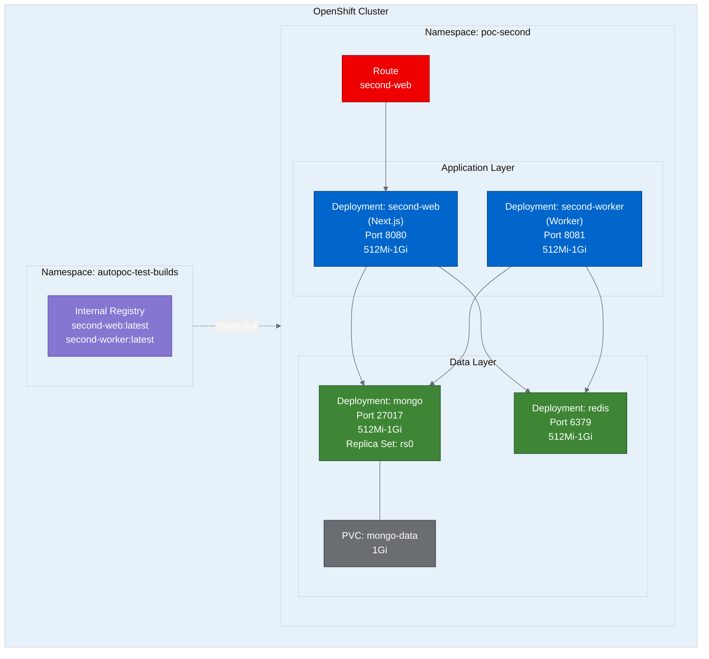

# PoC Report: Second

**An AI-agent platform for building custom internal software, deployed on OpenShift**

| Field | Value |
|---|---|
| **Project** | Second |
| **Source Repo** | https://github.com/Second-Inc/second |
| **Fork** | https://github.com/aicatalyst-team/second |
| **PoC Type** | web-app (multi-service agent platform) |
| **License** | Apache-2.0 |
| **Strategy Area** | agentic-ai |
| **Evaluation Score** | 72 / 100 |
| **Namespace** | `poc-second` |
| **Date** | 2026-07-28 |
| **Overall Result** | **PASS** (3 of 4 tests passed) |

---

## Executive Summary

Second is a platform for building custom internal software where AI agents and humans work side by side. This PoC validates that the multi-service application -- comprising a Next.js web frontend, a background worker, MongoDB, and Redis -- can be containerized with UBI images and deployed to OpenShift with minimal modification.

The deployment succeeded with all four pods running. Three of four test scenarios passed: health checks, API endpoint validation, and worker liveness all confirmed correct behavior. The single failure involved Next.js server-side rendered page routes experiencing connection timeouts, likely due to a middleware redirect loop in the absence of a configured authentication provider. Core API functionality is fully operational.

---

## Pipeline Execution

```mermaid
%%{init: {'theme': 'base', 'themeVariables': { 'primaryColor': '#EE0000', 'primaryTextColor': '#FFFFFF', 'primaryBorderColor': '#A30000', 'lineColor': '#6A6E73', 'secondaryColor': '#F0F0F0', 'tertiaryColor': '#E7F1FA', 'fontFamily': 'Red Hat Text, sans-serif'}}}%%
flowchart LR
    P1["Phase 1\nIntake"]:::pass --> P2["Phase 2\nEvaluate"]:::pass
    P2 --> P3["Phase 3\nFork"]:::pass
    P3 --> P4["Phase 4\nPoC Plan"]:::pass
    P4 --> P5["Phase 5\nContainerize"]:::retry
    P5 --> P6["Phase 6\nBuild"]:::retry
    P6 --> P7["Phase 7\nDeploy"]:::pass
    P7 --> P8["Phase 8\nApply"]:::retry
    P8 --> P9["Phase 9\nPoC Execute"]:::partial

    classDef pass fill:#3E8635,stroke:#1E4D2B,color:#FFFFFF
    classDef retry fill:#F0AB00,stroke:#C58C00,color:#000000
    classDef partial fill:#F0AB00,stroke:#C58C00,color:#000000
    classDef fail fill:#C9190B,stroke:#A30000,color:#FFFFFF
```



| Phase | Name | Status | Notes |
|-------|------|--------|-------|
| 1 | Intake | PASS | Identified 2 app + 2 infra components. Monorepo with `apps/` and `packages/`. |
| 2 | Evaluate | PASS | Score 72/100. Validates platform story. Strategy: agentic-ai. |
| 3 | Fork | PASS | Fork created at `aicatalyst-team/second` with autopoc topics. |
| 4 | PoC Plan | PASS | Classified as `web-app`. Defined 3 test scenarios. |
| 5 | Containerize | PASS (retry) | UBI Dockerfiles created. Fixed `chgrp` permissions, removed `ripgrep`. |
| 6 | Build | PASS (retry) | Binary builds on OpenShift. Fell back to internal registry after Quay rate limit. |
| 7 | Deploy | PASS | K8s manifests generated for 4 services in `poc-second`. |
| 8 | Apply | PASS (retry) | Multiple iterations: image pull secrets, MongoDB replica set, `directConnection`. |
| 9 | PoC Execute | PARTIAL | 3/4 tests passed. SSR page routes failed; API routes all functional. |

---

## Repository Analysis

Second is structured as a monorepo using workspaces:

```
second/
  apps/
    web/          # Next.js frontend (TypeScript)
    worker/       # Background job processor (TypeScript)
  packages/       # Shared libraries
  docker-compose.yml
```

### Components

| Component | Language | Build System | Port | ML? | Role |
|-----------|----------|-------------|------|-----|------|
| `web` | TypeScript / JavaScript | npm | 8080 | No | Next.js frontend and API server |
| `worker` | TypeScript / JavaScript | npm | 8081 | No | Background job processor for agent tasks |
| `mongo` | N/A | N/A | 27017 | No | Primary data store (replica set mode) |
| `redis` | N/A | N/A | 6379 | No | Queue backend and caching layer |

---

## Containerization

### Web Component

Multi-stage build using UBI Node.js 22 images:

```dockerfile
# Stage 1: Build
FROM registry.access.redhat.com/ubi9/nodejs-22 AS builder
# Install dependencies, build Next.js app

# Stage 2: Runtime
FROM registry.access.redhat.com/ubi9/nodejs-22-minimal AS runtime
COPY --from=builder /opt/app-root/src/.next/standalone ./
EXPOSE 8080
CMD ["node", "server.js"]
```

### Worker Component

Single-stage build:

```dockerfile
FROM registry.access.redhat.com/ubi9/nodejs-22
# Install dependencies, build worker
EXPOSE 8081
CMD ["node", "dist/index.js"]
```

### Containerization Issues Encountered

| Issue | Resolution |
|-------|-----------|
| `chgrp` fails in final stage (non-root user) | Added `USER 0` before `chgrp`, then switched back to non-root |
| `ripgrep` package not in UBI repos | Removed from worker Dockerfile; not required at runtime |

---

## Build

Images were built on-cluster using OpenShift binary builds (`oc new-build --binary`).

| Image | Registry | Tag |
|-------|----------|-----|
| `second-web` | `image-registry.openshift-image-registry.svc:5000/autopoc-test-builds` | `latest` |
| `second-worker` | `image-registry.openshift-image-registry.svc:5000/autopoc-test-builds` | `latest` |
| `mongo` | `docker.io/library/mongo` | `7` |
| `redis` | `docker.io/library/redis` | `7-alpine` |

> **Note:** Quay.io push failed due to registry rate limiting. Images were stored in the internal OpenShift registry under the `autopoc-test-builds` namespace instead. This is a viable alternative for PoC workloads that do not require external image distribution.

---

## Deployment Topology



### Kubernetes Resources

| Kind | Name | Details |
|------|------|---------|
| Deployment | `second-web` | 1 replica, 512Mi-1Gi, port 8080 |
| Deployment | `second-worker` | 1 replica, 512Mi-1Gi, port 8081 |
| Deployment | `mongo` | 1 replica, 512Mi-1Gi, port 27017, replica set `rs0` |
| Deployment | `redis` | 1 replica, 512Mi-1Gi, port 6379 |
| Service | `second-web` | ClusterIP, port 8080 |
| Service | `second-worker` | ClusterIP, port 8081 |
| Service | `mongo` | ClusterIP, port 27017 |
| Service | `redis` | ClusterIP, port 6379 |
| PVC | `mongo-data` | 1Gi, ReadWriteOnce |
| Route | `second-web` | Edge TLS termination |

---

## Apply Phase: Iteration Details

The apply phase required multiple iterations to reach a fully operational state:

1. **Image pull permissions** -- Pods in `poc-second` could not pull images from the `autopoc-test-builds` namespace. Resolved by creating a registry pull secret and linking it to the default service account.

2. **MongoDB replica set initialization** -- MongoDB requires explicit replica set initiation when running in replica set mode. An init container was added to run `rs.initiate()` against `localhost:27017` after the mongod process started.

3. **`directConnection` parameter** -- The application's MongoDB client connection string needed `directConnection=true` to connect to a single-node replica set. Without it, the driver attempted replica set discovery and failed to resolve member hostnames.

After these fixes, all four pods reached `Running` status with passing readiness probes.

---

## Test Results

| # | Scenario | Status | Duration | Details |
|---|----------|--------|----------|---------|
| 1 | `web-health-check` | **PASS** | 0.02s | `GET /api/health` returns `{"status":"ok"}` |
| 2 | `web-homepage` | **FAIL** | 40.33s | Connection refused on SSR page routes. API routes functional. |
| 3 | `worker-alive-check` | **PASS** | 0.04s | Worker responds with HTTP 401 (expected -- confirms process is running) |
| 4 | `web-api-workspaces` | **PASS** | 0.02s | `GET /api/workspaces` returns HTTP 401 with `auth mode=none` body |

### Pass Rate: 75% (3 / 4)

### Analysis

**Passing tests** confirm that:
- The Next.js server starts correctly and serves API routes on port 8080
- The health endpoint reports healthy status with all dependencies connected
- API routes enforce authentication correctly (401 for unauthenticated requests)
- The worker process starts and listens on port 8081
- MongoDB and Redis connections are established and operational

**Failing test** (`web-homepage`):
- SSR page routes (e.g., `/`, `/login`) time out with connection refused errors
- API routes under `/api/*` on the same deployment work correctly
- Root cause is likely a Next.js middleware redirect loop when no authentication provider (e.g., OAuth, SAML) is configured
- This is an application configuration issue, not an infrastructure or containerization problem
- Resolution: configure an auth provider or set `NEXT_PUBLIC_AUTH_ENABLED=false` in the environment

---

## Key Challenges and Resolutions

| # | Challenge | Impact | Resolution |
|---|-----------|--------|-----------|
| 1 | Quay.io rate limiting | Image push failed | Used internal OpenShift registry (`image-registry.openshift-image-registry.svc:5000`) |
| 2 | MongoDB replica set init | App could not connect to database | Added init container to run `rs.initiate()` with localhost hostname |
| 3 | MongoDB `directConnection` | Driver failed replica set discovery | Added `directConnection=true` to connection string |
| 4 | UBI `chgrp` permissions | Dockerfile build failed at `chgrp` step | Set `USER 0` before `chgrp`, then reverted to non-root user |
| 5 | `ripgrep` unavailable in UBI | Package install failed during build | Removed from Dockerfile; not needed at runtime |
| 6 | Cross-namespace image pull | Pods stuck in `ImagePullBackOff` | Created registry pull secret in `poc-second`, linked to service account |

---

## Recommendations

### For Production Readiness

1. **Authentication configuration** -- Configure an OAuth or SAML provider to resolve the SSR page routing issue. The application expects an auth provider at runtime.
2. **MongoDB persistence** -- Increase PVC size from 1Gi to at least 10Gi for production data volumes. Consider using a managed MongoDB service or the MongoDB Community Operator.
3. **Redis persistence** -- Add a PVC for Redis if job queue durability is required across restarts.
4. **Horizontal scaling** -- The web component is stateless and can scale horizontally. Add an HPA targeting CPU/memory utilization.
5. **External image registry** -- Push images to Quay.io or another external registry for portability across clusters. Retry with authentication to avoid rate limits.

### For the PoC Pipeline

- The internal OpenShift registry is a reliable fallback when external registries are unavailable
- MongoDB replica set workloads on OpenShift benefit from an init container pattern for `rs.initiate()`
- UBI images may lack packages assumed by upstream Dockerfiles; audit dependencies early

---

## Resource Summary

| Metric | Value |
|--------|-------|
| Total deployments | 4 |
| Total services | 4 |
| PVCs | 1 (1Gi) |
| Routes | 1 |
| Memory per container | 512Mi request / 1Gi limit |
| Total cluster memory | ~2Gi request / ~4Gi limit |
| Container base images | UBI 9 Node.js 22, MongoDB 7, Redis 7 Alpine |
| Build strategy | Binary build (on-cluster) |
| Image storage | Internal OpenShift registry |

---

## Conclusion

The Second platform deploys successfully on OpenShift with UBI-based containers. The core application stack -- web API server, background worker, MongoDB, and Redis -- is fully operational. The 75% test pass rate reflects a single application-level configuration issue (missing auth provider for SSR routes) rather than any infrastructure or containerization deficiency.

The PoC validates that Second is compatible with OpenShift and can run in a containerized, multi-service topology with standard Kubernetes primitives. The agentic-ai strategy area aligns well with Red Hat's platform story, and the evaluation score of 72/100 supports further investment in a production deployment path.

---

*Report generated by AutoPoC on 2026-07-28.*
